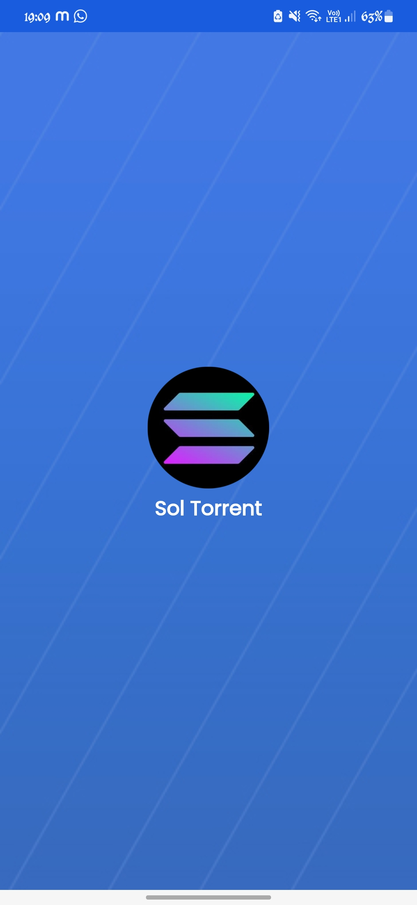
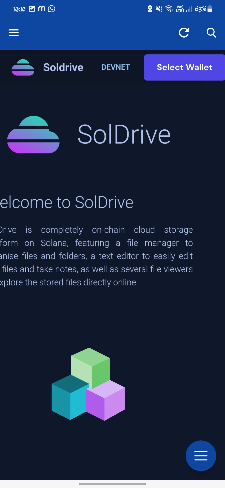
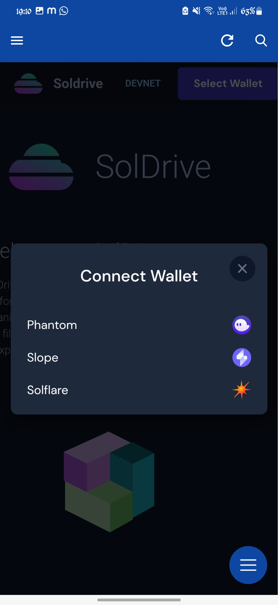
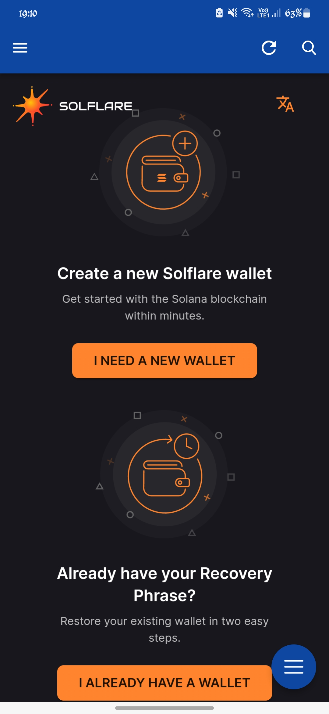
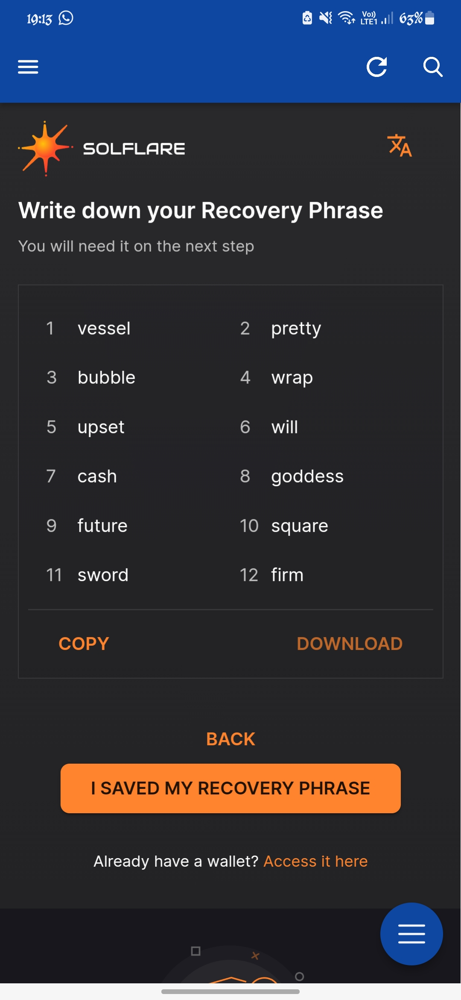
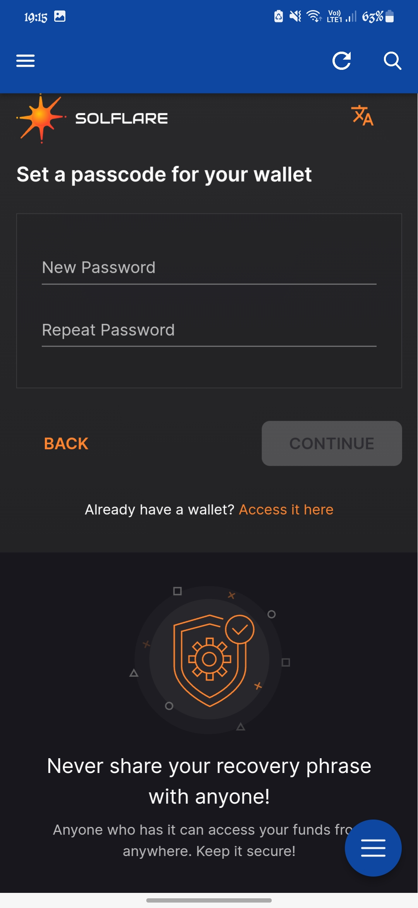
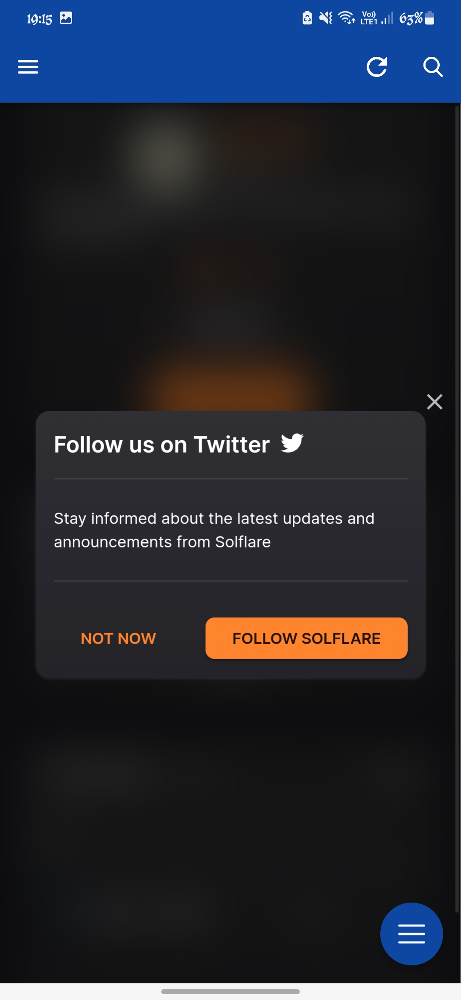

# SolTorrent🌈
# [Download App](https://drive.google.com/file/d/1ngIqac-RW3cpfyQvApUVhhUeo4EiUvDS/view?usp=share_link)   
 SolTorrent is completely on-chain cloud storage platform on [Solana](https://solana.com/), featuring a file manager to organise files and folders, a text editor to easily edit text files and take notes, as well as several file viewers to explore the stored files directly online.

### Feature of SolTorrent
- Solana Wallet Support, can approve through Solflare wallet, Phantom Wallet & Slope Wallet.
- The user can sign in using any Solana based wallet.
- The user can upload files, notes, pdf to the Solana blockchain.
- The uploaded content can be set as private or public.
- Each upload cost some SOLs and this ensures that the data stays forever on the blockchain.
- The links to the uploaded content can be shared to download via wallet transaction.

### ScreenShots of SolTorrent 
<pre>
       

</pre>

## Problem it Solves

- Files can be stored  on-chain directly via Solana Accounts.
- A specialized file chain, to drastically reduce the uploading cost. Links to those files are then maintained on chain.
- All the assets are encrypted by default using a key derived from a Solana Wallet.
- Minimalistic UX. Easy to access features. 

## Challenges we faced

- Implementing Devnet,localnet and testnet.
- Implementing a built-in note editor enables online notes edition.
- Installing anchor version.
- Deploying Smart contract.
- integrating multiple wallet solana payment gateway.

## Proposed Enhancements
- Curated database of contents on solana blockchain 
- Provide liquidity to SOL torrents and earn fees
- P2P trades
- Schedule origin tracking for contents

### Contributors
- Shashank Kumar
- Aman Gupta
- Richa Agrawal
- Shubhi Singh

Built with ❤️ by Team C.O.D.E
